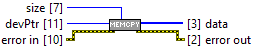

<h1>UInt8</h1>

<h2>Description</h2>

Frees memory on the device. Type : polymorphic.

<h3>Input parameters</h3>

<table>
  <tbody>
    <tr>
      <td width="64" valign="top"></td>
      <td valign="top"><strong>devPtr : <em>integer</em></strong></td>
    </tr>
    <tr>
      <td width="64" valign="top"></td>
      <td valign="top"><strong>size : <em>integer</em></strong></td>
    </tr>
  </tbody>
</table>

<h3>Output parameters</h3>

<table>
  <tbody>
    <tr>
      <td width="64" valign="top"></td>
      <td valign="top"><strong>data : <em>array of integer</em></strong>
<ul>
  <li> <strong>Numeric : <em>integer</em></strong></li>
</ul></td>
    </tr>
  </tbody>
</table>
