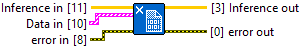

<h1>Free DML Ptr Data Cluster Array</h1>

<h2>Description</h2>

Free all the ptrs inside the Data in array. Type : VI.

<h3>Input parameters</h3>

<table>
  <tbody>
    <tr>
      <td valign="top" width="70%">
 <strong>Data in : <em>array of cluster</em></strong>

<table>
  <tbody>
    <tr>
      <td width="64" valign="top"></td>
      <td valign="top"><strong>frw_input_cluster : <em>cluster</em></strong>
<ul>
  <li> <strong>input_order : <em>integer</em></strong></li>
  <li> <strong>Inputs Info : <em>cluster</em></strong>
<ul>
  <li> <strong>inputs_ptr : <em>integer</em></strong></li>
  <li> <strong>inputs_shapes : <em>array of integer</em></strong>
<ul>
  <li> <strong>Numeric : <em>integer</em></strong></li>
</ul></li>
  <li> <strong>inputs_ranks : <em>integer</em></strong></li>
  <li> <strong>inputs_types : <em>enum</em></strong></li>
</ul></li>
</ul></td>
    </tr>
  </tbody>
</table>
      </td>
      <td valign="top" width="30%">

</td>
    </tr>
  </tbody>
</table>

<table>
  <tbody>
    <tr>
      <td width="64" valign="top"></td>
      <td valign="top"><strong>Inference in : <em>class</em></strong></td>
    </tr>
  </tbody>
</table>

<h3>Output parameters</h3>

<table>
  <tbody>
    <tr>
      <td width="64" valign="top"></td>
      <td valign="top"><strong>Inference out : <em>class</em></strong></td>
    </tr>
  </tbody>
</table>
