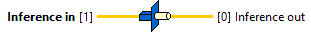

<h1>Copy Data From DirectML Ptr To LabVIEW Array</h1>

<h2>Description</h2>

This function copy the data stored inside DirectML ptr to store it locally in LabVIEW arrays. Type : polymorphic.

<h3>Input parameters</h3>

<table>
  <tbody>
    <tr>
      <td width="64" valign="top"></td>
      <td valign="top"><strong>Inference in : <em>class</em></strong></td>
    </tr>
  </tbody>
</table>

<h3>Output parameters</h3>

<table>
  <tbody>
    <tr>
      <td width="64" valign="top"></td>
      <td valign="top"><strong>Inference out : <em>class</em></strong></td>
    </tr>
  </tbody>
</table>
