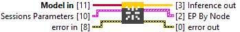

<h1>CPU</h1>

<h2>Description</h2>

Generate the ONNX Graph then create a CPU Session from it. Type : polymorphic.

<h3>Input parameters</h3>

<table>
  <tbody>
    <tr>
      <td width="64" valign="top"></td>
      <td valign="top"><strong>Model in : <em>class</em></strong></td>
    </tr>
  </tbody>
</table>

<table>
  <tbody>
    <tr>
      <td valign="top" width="70%">
 <strong>Sessions Parameters : <em>cluster</em></strong>

<table>
  <tbody>
    <tr>
      <td width="64" valign="top"></td>
      <td valign="top"><strong>intra_op_num_threads : <em>integer</em></strong></td>
    </tr>
    <tr>
      <td width="64" valign="top"></td>
      <td valign="top"><strong>inter_op_num_threads : <em>integer</em></strong></td>
    </tr>
    <tr>
      <td width="64" valign="top"></td>
      <td valign="top"><strong>execution_mode : <em>enum</em></strong></td>
    </tr>
    <tr>
      <td width="64" valign="top"></td>
      <td valign="top"><strong>deterministic_compute : <em>boolean</em></strong></td>
    </tr>
    <tr>
      <td width="64" valign="top"></td>
      <td valign="top"><strong>graph_optimization_level : <em>integer</em></strong></td>
    </tr>
    <tr>
      <td width="64" valign="top"></td>
      <td valign="top"><strong>optimized_model_file_path : <em>path</em></strong></td>
    </tr>
    <tr>
      <td width="64" valign="top"></td>
      <td valign="top"><strong>profiling output dir : <em>path</em></strong></td>
    </tr>
  </tbody>
</table>
      </td>
      <td valign="top" width="30%">

</td>
    </tr>
  </tbody>
</table>

<h3>Output parameters</h3>

<table>
  <tbody>
    <tr>
      <td width="64" valign="top"></td>
      <td valign="top"><strong>Inference out : <em>class</em></strong></td>
    </tr>
  </tbody>
</table>

<table>
  <tbody>
    <tr>
      <td valign="top" width="70%">
 <strong>EP By Node : <em>array of cluster</em></strong>

<table>
  <tbody>
    <tr>
      <td width="64" valign="top"></td>
      <td valign="top"><strong>node_ep : <em>cluster</em></strong>
<ul>
  <li> <strong>Execution Provider : <em>string</em></strong></li>
  <li> <strong>Nodes Name : <em>array of string</em></strong>
<ul>
  <li> <strong>String : <em>string</em></strong></li>
</ul></li>
  <li> <strong>Nb Nodes : <em>integer</em></strong></li>
</ul></td>
    </tr>
  </tbody>
</table>
      </td>
      <td valign="top" width="30%">

</td>
    </tr>
  </tbody>
</table>
