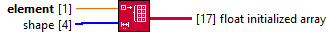

<h1>SGL</h1>

<h2>Description</h2>

Creates an float n-dimensional array in which every element is initialized to the value of element. Type : polymorphic.

<h3>Input parameters</h3>

<table>
  <tbody>
    <tr>
      <td width="64" valign="top"></td>
      <td valign="top"><strong>element : <em>float</em></strong></td>
    </tr>
    <tr>
      <td width="64" valign="top"></td>
      <td valign="top"><strong>shape : <em>array of integer</em></strong>
<ul>
  <li> <strong>Numeric : <em>integer</em></strong></li>
</ul></td>
    </tr>
  </tbody>
</table>

<h3>Output parameters</h3>

<table>
  <tbody>
    <tr>
      <td width="64" valign="top"></td>
      <td valign="top"><strong>float initialized array : <em>class</em></strong></td>
    </tr>
  </tbody>
</table>
