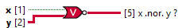

<h1>Nor Scalar Tensor</h1>

<h2>Description</h2>

Computes the logical NOR of the inputs. Both inputs must be Boolean values, numeric values. If both inputs are FALSE, the function returns TRUE. Otherwise, it returns FALSE. Type : polymorphic.

<h3>Input parameters</h3>

<table>
  <tbody>
    <tr>
      <td width="64" valign="top"></td>
      <td valign="top"><strong>x : <em>boolean</em></strong></td>
    </tr>
    <tr>
      <td width="64" valign="top"></td>
      <td valign="top"><strong>y : <em>class</em></strong></td>
    </tr>
  </tbody>
</table>

<h3>Output parameters</h3>

<table>
  <tbody>
    <tr>
      <td width="64" valign="top"></td>
      <td valign="top"><strong>x .nor. y ? : <em>class</em></strong></td>
    </tr>
  </tbody>
</table>
