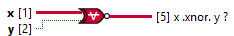

<h1>XNor Tensor Scalar</h1>

<h2>Description</h2>

Computes the logical negation of the logical exclusive or (XOR) of the inputs. Both inputs must be Boolean values, numeric values. If both inputs are TRUE or both inputs are FALSE, the function returns TRUE. Otherwise, it returns FALSE. Type : polymorphic.

<h3>Input parameters</h3>

<table>
  <tbody>
    <tr>
      <td width="64" valign="top"></td>
      <td valign="top"><strong>x : <em>class</em></strong></td>
    </tr>
    <tr>
      <td width="64" valign="top"></td>
      <td valign="top"><strong>y : <em>boolean</em></strong></td>
    </tr>
  </tbody>
</table>

<h3>Output parameters</h3>

<table>
  <tbody>
    <tr>
      <td width="64" valign="top"></td>
      <td valign="top"><strong>x .xnor. y ? : <em>class</em></strong></td>
    </tr>
  </tbody>
</table>
