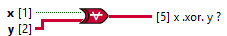

<h1>Xor Scalar Tensor</h1>

<h2>Description</h2>

Computes the logical exclusive or (XOR) of the inputs. Both inputs must be Boolean values, numeric values. If both inputs are TRUE or both inputs are FALSE, the function returns FALSE. Otherwise, it returns TRUE. Type : polymorphic.

<h3>Input parameters</h3>

<table>
  <tbody>
    <tr>
      <td width="64" valign="top"></td>
      <td valign="top"><strong>x : <em>boolean</em></strong></td>
    </tr>
    <tr>
      <td width="64" valign="top"></td>
      <td valign="top"><strong>y : <em>class</em></strong></td>
    </tr>
  </tbody>
</table>

<h3>Output parameters</h3>

<table>
  <tbody>
    <tr>
      <td width="64" valign="top"></td>
      <td valign="top"><strong>x .xor. y ? : <em>class</em></strong></td>
    </tr>
  </tbody>
</table>
