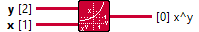

<h1>Pow Tensor Tensor</h1>

<h2>Description</h2>

Computes x raised to the y power. Accepted Dtype x : FLOAT/FLOAT16/BFLOAT16/DOUBLE/INT32/INT64 y : FLOAT/FLOAT16/BFLOAT16/DOUBLE/INT8/INT16/INT32/INT64 Type : polymorphic.

<h3>Input parameters</h3>

<table>
  <tbody>
    <tr>
      <td width="64" valign="top"></td>
      <td valign="top"><strong>x : <em>class</em></strong></td>
    </tr>
    <tr>
      <td width="64" valign="top"></td>
      <td valign="top"><strong>y : <em>class</em></strong></td>
    </tr>
  </tbody>
</table>

<h3>Output parameters</h3>

<table>
  <tbody>
    <tr>
      <td width="64" valign="top"></td>
      <td valign="top"><strong>x^y : <em>class</em></strong></td>
    </tr>
  </tbody>
</table>
