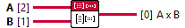

<h1>Mat Mul</h1>

<h2>Description</h2>

Performs the multiplication of two input matrices or an input matrix and an input vector. Accepted Dtype X Vector | Y Vector : FLOAT/FLOAT16/BFLOAT16/DOUBLE/UINT32/UINT64/INT32/INT64 Type : VI.

<h3>Input parameters</h3>

<table>
  <tbody>
    <tr>
      <td width="64" valign="top"></td>
      <td valign="top"><strong>A : <em>class</em></strong></td>
    </tr>
    <tr>
      <td width="64" valign="top"></td>
      <td valign="top"><strong>B : <em>class</em></strong></td>
    </tr>
  </tbody>
</table>

<h3>Output parameters</h3>

<table>
  <tbody>
    <tr>
      <td width="64" valign="top"></td>
      <td valign="top"><strong>A x B : <em>class</em></strong></td>
    </tr>
  </tbody>
</table>
