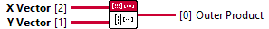

<h1>Outer Product</h1>

<h2>Description</h2>

Computes the outer product of X Vector and Y Vector. Accepted Dtype X Vector | Y Vector : FLOAT/FLOAT16/BFLOAT16/DOUBLE/UINT8..UINT64/INT8..INT64 Type : VI.

<h3>Input parameters</h3>

<table>
  <tbody>
    <tr>
      <td width="64" valign="top"></td>
      <td valign="top"><strong>X Vector : <em>class</em></strong></td>
    </tr>
    <tr>
      <td width="64" valign="top"></td>
      <td valign="top"><strong>Y Vector : <em>class</em></strong></td>
    </tr>
  </tbody>
</table>

<h3>Output parameters</h3>

<table>
  <tbody>
    <tr>
      <td width="64" valign="top"></td>
      <td valign="top"><strong>Outer Product : <em>class</em></strong></td>
    </tr>
  </tbody>
</table>
