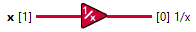

<h1>Reciprocal</h1>

<h2>Description</h2>

Divides 1 by the input value. Accepted Dtype x : SGL,DBL,FLOAT16,BFLOAT16,INT8...INT64 Type : polymorphic.

<h3>Input parameters</h3>

<table>
  <tbody>
    <tr>
      <td width="64" valign="top"></td>
      <td valign="top"><strong>x : <em>class</em></strong></td>
    </tr>
  </tbody>
</table>

<h3>Output parameters</h3>

<table>
  <tbody>
    <tr>
      <td width="64" valign="top"></td>
      <td valign="top"><strong>1/x : <em>class</em></strong></td>
    </tr>
  </tbody>
</table>
