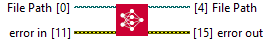

<h1>Netron From File</h1>

<h2>Description</h2>

Open Netron visualization of the given file. Type : polymorphic.

<h3>Input parameters</h3>

<table>
  <tbody>
    <tr>
      <td width="64" valign="top"></td>
      <td valign="top"><strong>File Path : <em>path</em></strong></td>
    </tr>
  </tbody>
</table>

<h3>Output parameters</h3>

<table>
  <tbody>
    <tr>
      <td width="64" valign="top"></td>
      <td valign="top"><strong>File Path : <em>path</em></strong></td>
    </tr>
  </tbody>
</table>
