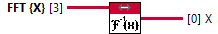

<h1>1D Real Optimized (only CUDA)</h1>

<h2>Description</h2>

Computes the inverse discrete Fourier transform (IDFT) of the input sequence FFT {X}. Warning : This function is only available in CUDA. Accepted Dtype FFT {X} : COMPLEX FLOAT/COMPLEX DOUBLE Accepted Rank FFT {X} : 1D (output of FFT with even Real X) Type : polymorphic.

<h3>Input parameters</h3>

<table>
  <tbody>
    <tr>
      <td width="64" valign="top"></td>
      <td valign="top"><strong>FFT {X} : <em>class</em></strong></td>
    </tr>
  </tbody>
</table>

<h3>Output parameters</h3>

<table>
  <tbody>
    <tr>
      <td width="64" valign="top"></td>
      <td valign="top"><strong>X : <em>class</em></strong></td>
    </tr>
  </tbody>
</table>
