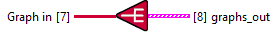
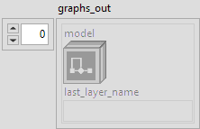

<h1>Advanced</h1>

<h2>Description</h2>

Allows you to retrieve the different merged graphs. For example you can use it to add a new layer to a branch. Type : polymorphic.

<h3>Input parameters</h3>

<table>
  <tbody>
    <tr>
      <td width="64" valign="top"></td>
      <td valign="top"><strong>Graph in : <em>class</em></strong></td>
    </tr>
  </tbody>
</table>

<h3>Output parameters</h3>

<table>
  <tbody>
    <tr>
      <td valign="top" width="70%">
 <strong>graphs_out : <em>array of cluster</em></strong>

<table>
  <tbody>
    <tr>
      <td width="64" valign="top"></td>
      <td valign="top"><strong>model : <em>class</em></strong></td>
    </tr>
    <tr>
      <td width="64" valign="top"></td>
      <td valign="top"><strong>last_layer_name : <em>string</em></strong></td>
    </tr>
  </tbody>
</table>
      </td>
      <td valign="top" width="30%">

</td>
    </tr>
  </tbody>
</table>
