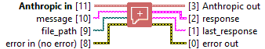
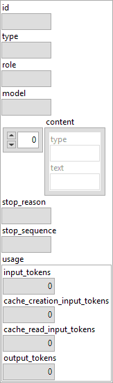

<h1>Simplify PDF Message</h1>

<h2>Description</h2>

Claude works with any standard PDF. You can ask Claude about any text, pictures, charts, and tables in the PDFs you provide. Some sample use cases: - Analyzing financial reports and understanding charts/tables - Extracting key information from legal documents - Translation assistance for documents - Converting document information into structured formats Type : VI.

<h3>Input parameters</h3>

<table>
  <tbody>
    <tr>
      <td width="64" valign="top"></td>
      <td valign="top"><strong>Anthropic in : <em>class</em></strong></td>
    </tr>
    <tr>
      <td width="64" valign="top"></td>
      <td valign="top"><strong>message : <em>string</em></strong></td>
    </tr>
    <tr>
      <td width="64" valign="top"></td>
      <td valign="top"><strong>file_path : <em>path</em></strong></td>
    </tr>
  </tbody>
</table>

<h3>Output parameters</h3>

<table>
  <tbody>
    <tr>
      <td width="64" valign="top"></td>
      <td valign="top"><strong>Anthropic out : <em>class</em></strong></td>
    </tr>
  </tbody>
</table>

<table>
  <tbody>
    <tr>
      <td valign="top" width="70%">
 <strong>response : <em>cluster</em></strong>

<table>
  <tbody>
    <tr>
      <td width="64" valign="top"></td>
      <td valign="top"><strong>id : <em>string</em></strong></td>
    </tr>
    <tr>
      <td width="64" valign="top"></td>
      <td valign="top"><strong>type : <em>string</em></strong></td>
    </tr>
    <tr>
      <td width="64" valign="top"></td>
      <td valign="top"><strong>role : <em>string</em></strong></td>
    </tr>
    <tr>
      <td width="64" valign="top"></td>
      <td valign="top"><strong>model : <em>string</em></strong></td>
    </tr>
    <tr>
      <td width="64" valign="top"></td>
      <td valign="top"><strong>content : <em>array of cluster</em></strong>
<ul>
  <li> <strong>type : <em>string</em></strong></li>
  <li> <strong>text : <em>string</em></strong></li>
</ul></td>
    </tr>
    <tr>
      <td width="64" valign="top"></td>
      <td valign="top"><strong>stop_reason : <em>string</em></strong></td>
    </tr>
    <tr>
      <td width="64" valign="top"></td>
      <td valign="top"><strong>stop_sequence : <em>string</em></strong></td>
    </tr>
    <tr>
      <td width="64" valign="top"></td>
      <td valign="top"><strong>usage : <em>cluster</em></strong>
<ul>
  <li> <strong>input_tokens : <em>integer</em></strong></li>
  <li> <strong>cache_creation_input_tokens : <em>integer</em></strong></li>
  <li> <strong>cache_read_input_tokens : <em>integer</em></strong></li>
  <li> <strong>output_tokens : <em>integer</em></strong></li>
</ul></td>
    </tr>
  </tbody>
</table>
      </td>
      <td valign="top" width="30%">

</td>
    </tr>
  </tbody>
</table>

<table>
  <tbody>
    <tr>
      <td width="64" valign="top"></td>
      <td valign="top"><strong>last_response : <em>string</em></strong></td>
    </tr>
  </tbody>
</table>
