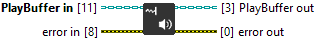

<h1>EndSoundBufferStream</h1>

<h2>Description</h2>

Signals that no more samples will be added to the buffer session. Must be called before &quot;Free Playback Session&quot; or the session won&#x27;t be deleted. Type : VI.

<h3>Input parameters</h3>

<table>
  <tbody>
    <tr>
      <td width="64" valign="top"></td>
      <td valign="top"><strong>PlayBuffer in : <em>class</em></strong></td>
    </tr>
  </tbody>
</table>

<h3>Output parameters</h3>

<table>
  <tbody>
    <tr>
      <td width="64" valign="top"></td>
      <td valign="top"><strong>PlayBuffer out : <em>class</em></strong></td>
    </tr>
  </tbody>
</table>
