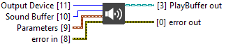

<h1>Play Sound From A Buffer</h1>

<h2>Description</h2>

Play a Sound Buffer. Typically used alongside a TTS (Text-to-Speech) buffer. Type : polymorphic.

<h3>Input parameters</h3>

<table>
  <tbody>
    <tr>
      <td width="64" valign="top"></td>
      <td valign="top"><strong>Sound Buffer : <em>integer</em></strong></td>
    </tr>
    <tr>
      <td width="64" valign="top"></td>
      <td valign="top"><strong>Output Device : <em>integer</em></strong></td>
    </tr>
  </tbody>
</table>

<table>
  <tbody>
    <tr>
      <td valign="top" width="100%"><table>
  <tbody>
    <tr>
      <td width="64" valign="top"></td>
      <td valign="top"><strong>Parameters : <em>cluster</em></strong>
<ul>
  <li> <strong>volume : <em>float</em></strong></li>
  <li> <strong>sampleRate : <em>integer</em></strong></li>
  <li> <strong>Channels : <em>integer</em></strong></li>
</ul></td>
    </tr>
  </tbody>
</table></td>
    </tr>
  </tbody>
</table>

<h3>Output parameters</h3>

<table>
  <tbody>
    <tr>
      <td width="64" valign="top"></td>
      <td valign="top"><strong>PlayBuffer out : <em>class</em></strong></td>
    </tr>
  </tbody>
</table>
