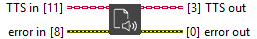

<h1>Close</h1>

<h2>Description</h2>

Initialize a session and its buffer Type : polymorphic.

<h3>Input parameters</h3>

<table>
  <tbody>
    <tr>
      <td width="64" valign="top"></td>
      <td valign="top"><strong>TTS in : <em>class</em></strong></td>
    </tr>
  </tbody>
</table>

<h3>Output parameters</h3>

<table>
  <tbody>
    <tr>
      <td width="64" valign="top"></td>
      <td valign="top"><strong>TTS out : <em>class</em></strong></td>
    </tr>
  </tbody>
</table>
