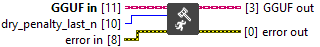

<h1>Dry Penalty Last N</h1>

<h2>Description</h2>

Set dry_penalty_last_n to common_params stored in local. NB :how many tokens to scan for repetitions (0 = disable penalty, -1 = context size) Type : polymorphic.

<h3>Input parameters</h3>

<table>
  <tbody>
    <tr>
      <td width="64" valign="top"></td>
      <td valign="top"><strong>GGUF in : <em>class</em></strong></td>
    </tr>
    <tr>
      <td width="64" valign="top"></td>
      <td valign="top"><strong>dry_penalty_last_n : <em>integer</em></strong></td>
    </tr>
  </tbody>
</table>

<h3>Output parameters</h3>

<table>
  <tbody>
    <tr>
      <td width="64" valign="top"></td>
      <td valign="top"><strong>GGUF out : <em>class</em></strong></td>
    </tr>
  </tbody>
</table>
