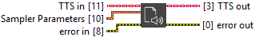

<h1>Sampler</h1>

<!-- GENAI_EXPERIMENTAL_NOTICE_START -->
<blockquote>

<strong>Experimental documentation.</strong> This GenAI Toolkit page is experimental and may change significantly while the toolkit is being validated.

</blockquote>
<!-- GENAI_EXPERIMENTAL_NOTICE_END -->

<h2>Description</h2>

Free the sampler and create a new one with the input parameters. Type : polymorphic.

<h3>Input parameters</h3>

<table>
  <tbody>
    <tr>
      <td width="64" valign="top"></td>
      <td valign="top"><strong>TTS in : <em>class</em></strong></td>
    </tr>
  </tbody>
</table>

<table>
  <tbody>
    <tr>
      <td valign="top" width="100%"><table>
  <tbody>
    <tr>
      <td width="64" valign="top"></td>
      <td valign="top"><strong>Sampler Parameters : <em>cluster</em></strong>
<ul>
  <li> <strong>temperature : <em>float</em></strong></li>
  <li> <strong>top_p : <em>float</em></strong></li>
  <li> <strong>min_p : <em>float</em></strong></li>
  <li> <strong>top_k : <em>integer</em></strong></li>
</ul></td>
    </tr>
  </tbody>
</table></td>
    </tr>
  </tbody>
</table>

<h3>Output parameters</h3>

<table>
  <tbody>
    <tr>
      <td width="64" valign="top"></td>
      <td valign="top"><strong>TTS out : <em>class</em></strong></td>
    </tr>
  </tbody>
</table>
