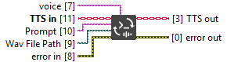

<h1>File</h1>

<!-- GENAI_EXPERIMENTAL_NOTICE_START -->
<blockquote>

<strong>Experimental documentation.</strong> This GenAI Toolkit page is experimental and may change significantly while the toolkit is being validated.

</blockquote>
<!-- GENAI_EXPERIMENTAL_NOTICE_END -->

<h2>Description</h2>

Run TTS and save the result into .wav file. Type : polymorphic.

<h3>Input parameters</h3>

<table>
  <tbody>
    <tr>
      <td width="64" valign="top"></td>
      <td valign="top"><strong>TTS in : <em>class</em></strong></td>
    </tr>
    <tr>
      <td width="64" valign="top"></td>
      <td valign="top"><strong>Prompt : <em>string</em></strong></td>
    </tr>
    <tr>
      <td width="64" valign="top"></td>
      <td valign="top"><strong>Wav File Path : <em>path</em></strong></td>
    </tr>
    <tr>
      <td width="64" valign="top"></td>
      <td valign="top"><strong>voice : <em>string</em></strong></td>
    </tr>
  </tbody>
</table>

<h3>Output parameters</h3>

<table>
  <tbody>
    <tr>
      <td width="64" valign="top"></td>
      <td valign="top"><strong>TTS out : <em>class</em></strong></td>
    </tr>
  </tbody>
</table>
