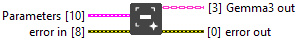

<h1>Session</h1>

<h2>Description</h2>

Initialize a session. Type : polymorphic.

<h3>Input parameters</h3>

<table>
  <tbody>
    <tr>
      <td valign="top" width="100%"><table>
  <tbody>
    <tr>
      <td width="64" valign="top"></td>
      <td valign="top"><strong>Parameters : <em>cluster</em></strong>
<ul>
  <li> <strong>Model File Path : <em>path</em></strong></li>
  <li> <strong>MMProj File Path : <em>path</em></strong></li>
  <li> <strong>n cpu threads : <em>integer</em></strong></li>
  <li> <strong>nb gpu layers : <em>integer</em></strong></li>
  <li> <strong>n_ctx : <em>integer</em></strong></li>
  <li> <strong>system prompt : <em>string</em></strong></li>
</ul></td>
    </tr>
  </tbody>
</table></td>
    </tr>
  </tbody>
</table>

<h3>Output parameters</h3>

<table>
  <tbody>
    <tr>
      <td width="64" valign="top"></td>
      <td valign="top"><strong>Gemma3 out : <em>class</em></strong></td>
    </tr>
  </tbody>
</table>
