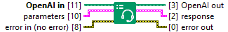
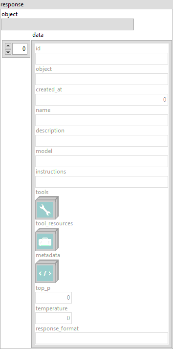

<h1>Get Assistants List</h1>

<h2>Description</h2>

Type : VI.

<h3>Input parameters</h3>

<table>
  <tbody>
    <tr>
      <td width="64" valign="top"></td>
      <td valign="top"><strong>OpenAI in : <em>class</em></strong></td>
    </tr>
  </tbody>
</table>

<table>
  <tbody>
    <tr>
      <td valign="top" width="70%">
 <strong>parameters : <em>cluster</em></strong>

<table>
  <tbody>
    <tr>
      <td width="64" valign="top"></td>
      <td valign="top"><strong>limit (optional) : <em>integer</em></strong></td>
    </tr>
    <tr>
      <td width="64" valign="top"></td>
      <td valign="top"><strong>order (optional) : <em>string</em></strong></td>
    </tr>
    <tr>
      <td width="64" valign="top"></td>
      <td valign="top"><strong>after (optional) : <em>string</em></strong></td>
    </tr>
    <tr>
      <td width="64" valign="top"></td>
      <td valign="top"><strong>before (optional) : <em>string</em></strong></td>
    </tr>
  </tbody>
</table>
      </td>
      <td valign="top" width="30%">

</td>
    </tr>
  </tbody>
</table>

<h3>Output parameters</h3>

<table>
  <tbody>
    <tr>
      <td width="64" valign="top"></td>
      <td valign="top"><strong>OpenAI out : <em>class</em></strong></td>
    </tr>
  </tbody>
</table>

<table>
  <tbody>
    <tr>
      <td valign="top" width="70%">
 <strong>response : <em>cluster</em></strong>

<table>
  <tbody>
    <tr>
      <td width="64" valign="top"></td>
      <td valign="top"><strong>object : <em>string</em></strong></td>
    </tr>
    <tr>
      <td width="64" valign="top"></td>
      <td valign="top"><strong>data : <em>array of cluster</em></strong>
<ul>
  <li> <strong>response 2 : <em>cluster</em></strong>
<ul>
  <li> <strong>id : <em>string</em></strong></li>
  <li> <strong>object : <em>string</em></strong></li>
  <li> <strong>created_at : <em>integer</em></strong></li>
  <li> <strong>name : <em>string</em></strong></li>
  <li> <strong>description : <em>string</em></strong></li>
  <li> <strong>model : <em>string</em></strong></li>
  <li> <strong>instructions : <em>string</em></strong></li>
  <li> <strong>tools : <em>class</em></strong></li>
  <li> <strong>tool_resources : <em>class</em></strong></li>
  <li> <strong>metadata : <em>class</em></strong></li>
  <li> <strong>top_p : <em>float</em></strong></li>
  <li> <strong>temperature : <em>float</em></strong></li>
  <li> <strong>response_format : <em>string</em></strong></li>
</ul></li>
</ul></td>
    </tr>
  </tbody>
</table>
      </td>
      <td valign="top" width="30%">

</td>
    </tr>
  </tbody>
</table>
